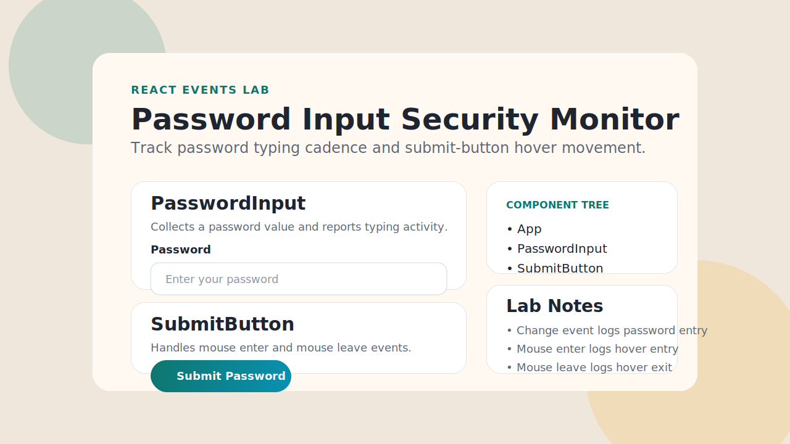

# Password Input Lab

This project is a small React lab focused on event handling. It renders a password field and a submit button, then tracks three interactions needed by a future anti-bot workflow:

- typing in the password field
- moving the mouse onto the submit button
- moving the mouse away from the submit button

## Component Tree

```text
App
|- PasswordInput
|- SubmitButton
```

## Component Descriptions

- `App` organizes the page layout and connects the two interactive child components.
- `PasswordInput` renders one password input, logs `Entering password...` on each change event, and exposes a small UI status showing the current character count.
- `SubmitButton` renders the `Submit Password` button, logs `Mouse Entering` on mouse enter, logs `Mouse Exiting` on mouse leave, and exposes a small hover status for testing.

## Run The Project

1. Install dependencies:

```bash
npm install
```

2. Start the development server:

```bash
npm run dev
```

3. Open the local URL shown by Vite in your browser.

4. Build a production bundle when needed:

```bash
npm run build
```

## Run Tests

Run the automated test suite with:

```bash
npm test
```

The tests cover:

- password input rendering and `type="password"`
- console logging on text changes
- submit button rendering
- console logging on mouse enter and mouse leave
- rapid input updates as an edge case

## Screenshot

Preview image:



## Notes

- There are no `Home.jsx`, `About.jsx`, or `Links.jsx` files in this workspace, so that documentation requirement is not applicable to this repo.
- You do not need to create an empty GitHub repository just to complete this lab locally. Only create or push to GitHub if your class or client specifically requires remote version control.

## License

This project uses the MIT License.
